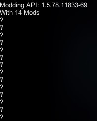

# Hide Mod List
- A simple mod to hide your modlist or reduce the space your modlist takes.
- It does not remove the text for Modding API or for mods that loaded with errors

## Settings in ModMenu
- Hide Mod List => Whether or not to hide modlist. (Default: True),
- Placeholder Text => The text that will be shown when modlist is hidden (Default: "?")
- Hide/Show with play mode menu => Should ModList hide or show with play mode menu. For use with for MenuChanger
- Toggle Mod List Keybind => A keybind to toggle whether modlist is hidden or not. Will only work when modlist is visible (Default: none)

## Mod Interop
Hide mod list allows other mods, via MonoMod's ModInterop, to call HideModLists internal functions.
To do this, add the following code to your mod and then you will be able to call the following methods:
- `HideModList.HideList()` => Hides the mod list
- `HideModList.ShowList()` => Shows the mod list
- `HideModList.UpdateListState(bool isHidden)` => Changes the state of the list of mods to hidden or shown depending on the the value of `isHidden`
```cs
using System;
using MonoMod.ModInterop;

// Replace the namespace with your project's root namespace
namespace YourModNameSpace
{
    internal static class HideModList
    {
        [ModImportName("HideModList")]
        private static class HideModListImport
        {
            public static Action ShowList = null;
            public static Action HideList = null;
            public static Action<bool> UpdateListState = null;
        }
        static HideModList()
        {
            // MonoMod will automatically fill in the actions in HideModListImport the first time they're used
            typeof(HideModListImport).ModInterop();
        }

        /// <summary>
        /// Forces list of mods to be hidden
        /// </summary>
        public static void HideList()
            => HideModListImport.HideList?.Invoke();   
            
        /// <summary>
        /// Forces list of mods to be shown
        /// </summary>
        public static void ShowList()
            => HideModListImport.ShowList?.Invoke();

        /// <summary>
        /// Changes the state of the list of mods to hidden or shown depending on the the value of <paramref name="isHidden"/>
        /// <param name="isHidden">Should the list be hidden</param>
        /// </summary>
        public static void UpdateListState(bool isHidden) 
            => HideModListImport.UpdateListState?.Invoke(isHidden);
    }
}

```

## Mod Showcase
  
Note: You can choose different Placeholder Texts by editing the global settings file.  
