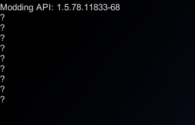

# Hide Mod List
- A simple mod to hide your modlist for whatever reason
- It does not remove the text for Modding API or for mods that loaded with errors

## Settings in ModMenu
- Hide Mod List => Whether or not to hide modlist. (Defualt: True),
- Placeholder Text => The text that will be shown when modlist is hidden (Defualt: "?")
- Toggle Mod List Keybind => A keybind to toggle whether modlist is hidden or not. Will only work when modlist is visible (Defualt: none)

Note: You can choose different Placeholder Texts by editing the globalsetting file.
